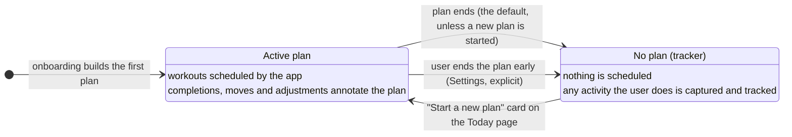
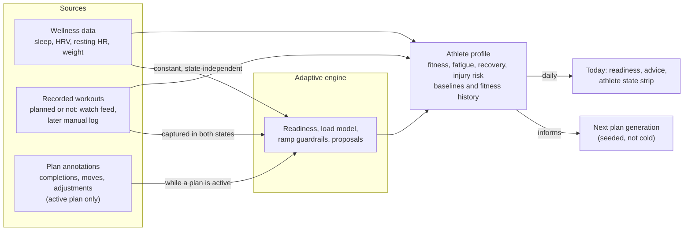

# The no-plan flow

The lifecycle and data flow of the no-plan (tracker) state, as decided by Jon
on 2026-07-13. This diagram is the TARGET model; the table at the bottom marks
what is shipped today versus pending. Two product decisions are recorded here
that supersede earlier drafts of docs/NO_PLAN_WORKFLOW.md:

1. **No plan is the default end state.** When a plan ends, the app defaults to
   the no-plan state unless the user starts a new plan. (The earlier design
   treated tracker entry as explicit-only; this flips that for the plan-ended
   case. Ending a plan mid-flight remains an explicit user action.)
2. **Tracked activity feeds the engine.** Workouts recorded while in the
   no-plan state are captured and feed the adaptive engine, so the next plan
   starts informed rather than cold.

## State lifecycle

## Data flow (runs in BOTH states)

The distinction between the two states is scheduling only: an active plan
schedules workouts for the user; the no-plan state schedules nothing. Sensing
never stops — wellness flows constantly, recorded workouts are captured in
both states, and both keep shaping the athlete profile the engine reasons
from.

## Shipped today vs this diagram

| Piece | Status |
|---|---|
| No-plan state exists; nothing scheduled; honest per-tab degradation | Shipped (tracker mode) |
| Exit via the "Start a new plan" card on Today | Shipped (the tracker card opens the race and dates picker) |
| Explicit early exit from a live plan (Settings) | Shipped |
| **Default to no plan when a plan ends** | Shipped. `planEnded` (plan.js): once the plan's last day has passed, the app enters tracker mode on the next load (hydration-gated so a stale cache never outruns the server view). The post-race and maintenance-horizon banners keep their window while plan days remain. |
| Wellness feeding the engine constantly, both states | Shipped (wellness store is plan-independent; readiness works in tracker) |
| Recorded workouts captured and displayed in both states | Shipped (watch feed on Today and Calendar, recap on tap, deep diary window) |
| **Recorded workouts feeding the engine in the no-plan state** | Pending (Phase 3 of docs/NO_PLAN_WORKFLOW.md: the sessions resource, manual quick-log, and next-plan seeding from trailing weekly minutes per discipline). Today the engine's run-load and derived-load signals read plan logs only, so they stand down in tracker mode. |
| Athlete profile from wellness and history | Partially shipped (athlete state strip: fitness, fatigue, recovery, run load; profile baselines and fitness history persist across states). The injury-risk tile and tracker-period seeding deepen it in Phase 3. |
